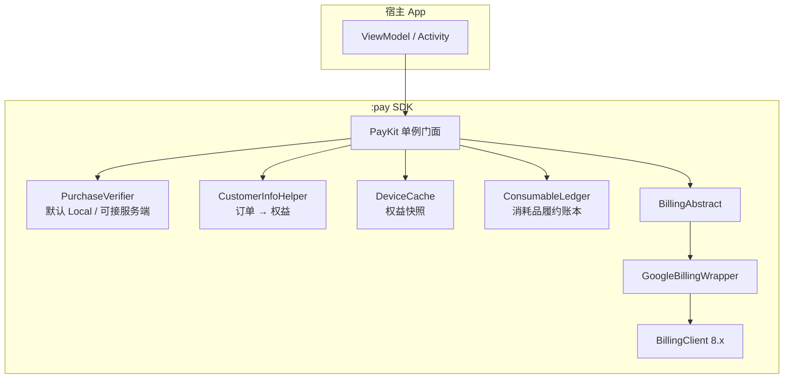
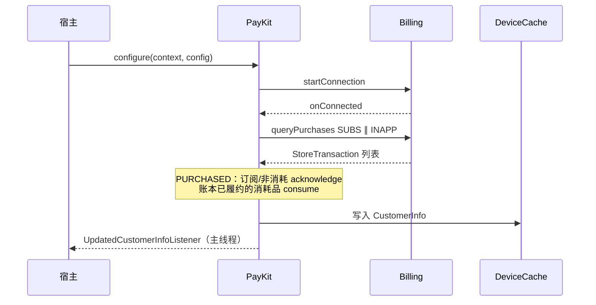
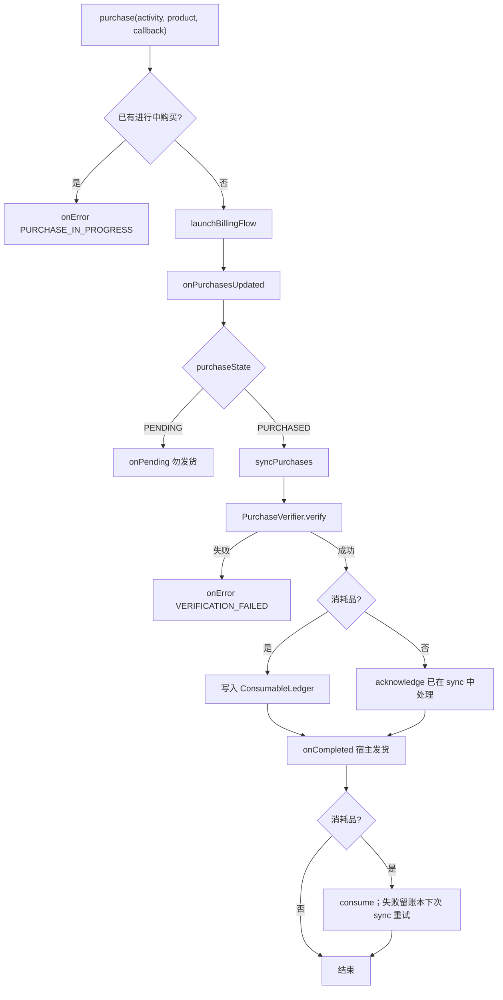
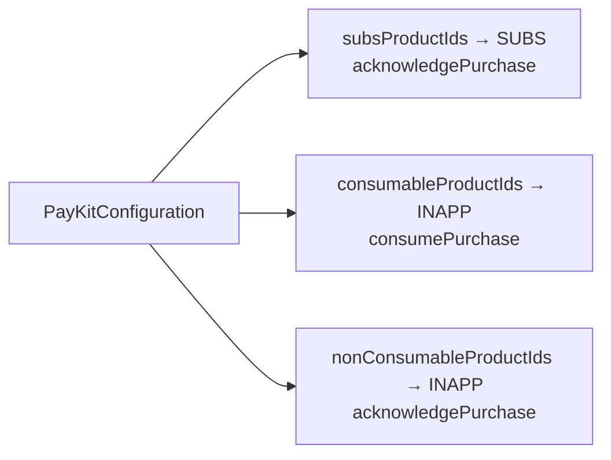

# PayKit - Google Play 支付 SDK

## 📖 简介

PayKit 是一个轻量级的 Android 支付结算库，封装了 Google Play Billing Library，提供简洁的协程 API。

**核心特性：**
- ✅ 完整的支付流程封装（查询、购买、确认）
- ✅ Kotlin 协程支持，无回调地狱
- ✅ 自动处理订单确认和权益同步
- ✅ 支持订阅商品、消耗型商品、非消耗型商品
- ✅ 内置订单恢复机制，防止掉单
- ✅ 线程安全；查询 / 同步可并发，购买同一时刻仅允许一笔进行中

---

## 🏗 架构与流程

### 代码架构

宿主只依赖 `PayKit` 门面；Billing、缓存、权益计算与可选验单扩展在库内分层协作。



| 组件 | 职责 |
|------|------|
| `PayKit` | 对外 API：配置、查询、购买、同步、恢复 |
| `GoogleBillingWrapper` | 连接商店、查询商品/订单、launchBillingFlow、ack/consume |
| `CustomerInfoHelper` | 按配置三分法归类订阅 / 消耗 / 非消耗 |
| `DeviceCache` | `CustomerInfo` 本地快照（秒开） |
| `ConsumableLedger` | 消耗品「已发货待 consume」落盘，防掉单与重复发货 |
| `PurchaseVerifier` | 发货前验单钩子；默认不联网 |

### 初始化与同步



### 购买流程



### 商品类型与确认方式

配置必须声明类型，补单才能选对 API（**勿**仅凭 `INAPP` 判断是否消耗）：



---

## 🚀 快速集成

### 步骤 1：添加依赖

**方式 A：JitPack（推荐）**

在 `settings.gradle.kts` 加入仓库：

```kotlin
dependencyResolutionManagement {
    repositories {
        google()
        mavenCentral()
        maven { url = uri("https://jitpack.io") }
    }
}
```

在 `app/build.gradle.kts` 添加依赖（版本用 Git Tag，如 `v1.0.0`）：

```kotlin
dependencies {
    implementation("com.github.e-hai:PayKit:v1.0.0")
}
```

> Billing 依赖已由 SDK 传递引入，宿主一般不必再单独声明。

**方式 B：本地模块**

```kotlin
dependencies {
    implementation(project(":pay"))
}
```

### 步骤 2：配置商品 ID

在 Google Play Console 创建商品后，记录商品 ID：

```kotlin
// Constants.kt — Demo 与 Play Console 对齐的示例
object Constants {
    // 一个订阅 product 对应一个权益档；周期为 base plan
    const val SUBS_PLUS = "subs_plus"
    const val SUBS_PRO = "subs_pro"

    // 消耗 / 非消耗（与 Demo applicationId 下 Console 商品一致）
    const val OTP_GAME_SKIN_3DAY = "consumable_product_01"
    const val OTP_GAME_SKIN_PERMANENT = "one_time_product_01"
}
```

### 步骤 3：初始化 SDK

在 Application 或 Activity 中初始化：

```kotlin
class MainViewModel(private val app: Application) : AndroidViewModel(app) {

    fun init() {
        // 1. 配置商品类型
        val configuration = PayKitConfiguration(
            subsProductIds = setOf(
                Constants.SUBS_PLUS,
                Constants.SUBS_PRO
            ),
            consumableProductIds = setOf(
                Constants.OTP_GAME_SKIN_3DAY
            ),
            nonConsumableProductIds = setOf(
                Constants.OTP_GAME_SKIN_PERMANENT
            )
        )

        // 2. 初始化 SDK
        PayKit.configure(app, configuration)
        
        // 3. 监听权益状态变化（可选）
        PayKit.shared.setUpdatedCustomerInfoListener(object : UpdatedCustomerInfoListener {
            override fun onReceived(customerInfo: CustomerInfo) {
                Log.d("PayKit", "权益状态更新: ${customerInfo.activeSubscriptions}")
                updateUiWithCustomerInfo(customerInfo)
            }
        })
    }
    
    private fun updateUiWithCustomerInfo(info: CustomerInfo) {
        val tier = when {
            Constants.SUBS_PRO in info.activeSubscriptions -> "Pro"
            Constants.SUBS_PLUS in info.activeSubscriptions -> "Plus"
            else -> "Free"
        }
        // 更新 UI
    }
}
```

---

## 💡 使用指南

### 场景 1：查询商品详情

```kotlin
viewModelScope.launch {
    try {
        val productIds = setOf(
            Constants.SUBS_PLUS,
            Constants.SUBS_PRO,
            Constants.OTP_GAME_SKIN_3DAY
        )
        
        val result = PayKit.shared.getProducts(productIds)
        
        result.onSuccess { products ->
            products.forEach { product ->
                Log.d("PayKit", "商品: ${product.productId}")
                Log.d("PayKit", "价格: ${product.price}")
                Log.d("PayKit", "标题: ${product.title}")
            }
        }.onFailure { error ->
            Log.e("PayKit", "查询失败: ${error.message}")
        }
    } catch (e: Exception) {
        Log.e("PayKit", "查询异常: ${e.message}")
    }
}
```

### 场景 2：发起支付

```kotlin
fun purchaseProduct(activity: Activity, productId: String) {
    viewModelScope.launch {
        try {
            // 1. 查询商品详情
            val result = PayKit.shared.getProducts(setOf(productId))
            
            result.onSuccess { products ->
                val product = products.firstOrNull()
                if (product != null) {
                    // 2. 发起支付
                    PayKit.shared.purchase(activity, product, object : PurchaseCallback {
                        override fun onCompleted(
                            storeTransaction: StoreTransaction,
                            customerInfo: CustomerInfo
                        ) {
                            Log.d("PayKit", "支付成功: ${storeTransaction.orderId}")
                            // 支付成功，SDK 已自动确认订单，可以立即发放权益
                        }

                        override fun onPending(storeTransaction: StoreTransaction) {
                            Log.d("PayKit", "支付待确认: ${storeTransaction.orderId}")
                            // 勿发货；付清后调用 restorePurchases() 或下次启动同步即可
                        }

                        override fun onError(error: PayKitError, userCancelled: Boolean) {
                            if (userCancelled) {
                                Log.d("PayKit", "用户取消支付")
                            } else {
                                Log.e("PayKit", "支付失败: ${error.message}")
                            }
                        }
                    })
                }
            }.onFailure { error ->
                Log.e("PayKit", "查询商品失败: ${error.message}")
            }
        } catch (e: Exception) {
            Log.e("PayKit", "支付异常: ${e.message}")
        }
    }
}
```

升降级 / 同商品换档时传入 `SubscriptionReplacement`（可用 `findActiveSubscription` 取旧 token）：

```kotlin
val old = PayKit.shared.findActiveSubscription("subs_plus")
val replacement = old?.let {
    SubscriptionReplacement(
        oldProductId = "subs_plus",
        oldPurchaseToken = it.purchaseToken
    )
}
PayKit.shared.purchase(activity, proProduct, callback, subscriptionReplacement = replacement)
```

### 场景 3：检查用户权益

```kotlin
// 方法 1：强制同步后查询（默认）
viewModelScope.launch {
    val customerInfo = PayKit.shared.getCustomerInfo() // forceSync = true
    if (customerInfo != null) {
        val tier = when {
            Constants.SUBS_PRO in customerInfo.activeSubscriptions -> "Pro"
            Constants.SUBS_PLUS in customerInfo.activeSubscriptions -> "Plus"
            else -> "Free"
        }
        val pending = customerInfo.pendingPurchases
        Log.d("PayKit", "当前档位: $tier, 待确认: ${pending.size}")
    }
}

// 方法 2：只读本地缓存（弱网秒开）
viewModelScope.launch {
    val cached = PayKit.shared.getCustomerInfo(forceSync = false)
}

// 方法 3：通过监听器自动接收更新（已在初始化时设置）
```

### 场景 4：恢复购买 / 补单

Google 没有独立的「恢复购买」系统 API；SDK 通过重新 `queryPurchases` 实现该产品能力。

```kotlin
// 「恢复购买」按钮
fun onRestoreClick() {
    viewModelScope.launch {
        PayKit.shared.restorePurchases()
            .onSuccess { info ->
                Log.d("PayKit", "恢复完成: ${info.activeSubscriptions}")
            }
            .onFailure { e ->
                Log.e("PayKit", "恢复失败: ${e.message}")
            }
    }
}

// 与 restorePurchases() 等价，语义偏「同步/补单」
suspend fun refresh() {
    PayKit.shared.syncPurchases()
}
```

**最佳实践：**
- 启动时 SDK 连接成功后会**自动 sync**；宿主用 `getCustomerInfo(forceSync = false)` 秒开 + `UpdatedCustomerInfoListener` 收同步结果即可，**不必再 forceSync 一次**
- 提供「恢复购买」按钮供用户手动触发（调用 `restorePurchases()`）
- 已消耗的消耗型商品无法恢复

---

## 🏗️ 核心 API

### PayKit 单例

```kotlin
val payKit = PayKit.shared

suspend fun getProducts(productIds: Set<String>): Result<List<StoreProduct>>
suspend fun getCustomerInfo(forceSync: Boolean = true): CustomerInfo?

/** 同步购买 / 补单 */
suspend fun syncPurchases(): Result<CustomerInfo>
/** 「恢复购买」按钮；实现同 syncPurchases */
suspend fun restorePurchases(): Result<CustomerInfo>

suspend fun getPendingPurchases(): List<StoreTransaction>
suspend fun getPurchaseHistory(): List<StoreTransaction>
fun findTransaction(purchaseToken: String): StoreTransaction?
fun findActiveSubscription(productId: String): StoreTransaction?

fun purchase(
    activity: Activity,
    storeProduct: StoreProduct,
    callback: PurchaseCallback,
    isOfferPersonalized: Boolean = ...,
    subscriptionReplacement: SubscriptionReplacement? = null
)
fun setUpdatedCustomerInfoListener(listener: UpdatedCustomerInfoListener?)
fun setPurchaseVerifier(verifier: PurchaseVerifier)  // 默认 Local；可换服务端验单
```

### 服务端验单扩展（可选）

```kotlin
PayKit.shared.setPurchaseVerifier(PurchaseVerifier { txn ->
    runCatching { api.verify(txn.purchaseToken, txn.productIds) }
        .fold(
            onSuccess = { Result.success(Unit) },
            onFailure = {
                Result.failure(
                    PayKitError(ErrorCode.VERIFICATION_FAILED, it.message ?: "verify fail")
                )
            }
        )
})
```

默认不配置则行为与原先「纯本地」一致。

```kotlin
// 更换配置或测试前：
PayKit.reset()                 // 默认同时清空本地权益缓存
PayKit.reset(clearCache = false)
PayKit.configure(context, newConfiguration)
```

### 数据模型

#### CustomerInfo - 用户权益信息
```kotlin
data class CustomerInfo(
    val activeSubscriptions: Set<String>,
    val nonConsumablePurchases: Set<String>,
    val allPurchaseRecords: List<StoreTransaction>,   // 当前商店快照
    val unfulfilledConsumables: List<StoreTransaction> // 待发货消耗品
)
```

消耗品：购买流程中 `onCompleted` 内发货即可（SDK 随后 consume；失败会留履约账本重试）。  
启动发现的未履约消耗品：

```kotlin
info.unfulfilledConsumables.forEach { txn ->
    // 发货…
    PayKit.shared.markConsumableFulfilled(txn.purchaseToken)
}
```

#### StoreProduct - 商品详情
```kotlin
data class StoreProduct(
    val productId: String,
    val type: ProductType,
    val title: String,
    val description: String,
    val price: String,                 // 展示价：订阅优先为正价（试用后）
    val priceAmountMicros: Long,
    val priceCurrencyCode: String,
    val subscriptionToken: String?,    // Google offerToken（订阅必填；INAPP 多 offer 亦需）
    val basePlanId: String? = null,
    val offerId: String? = null,
    val hasFreeTrial: Boolean = false,
    val freeTrialPeriod: String? = null  // 如 P1W
)
```

#### StoreTransaction - 交易记录
```kotlin
data class StoreTransaction(
    val orderId: String,
    val productIds: List<String>,
    val purchaseTime: Long,
    val purchaseToken: String,
    val isAcknowledged: Boolean,
    val purchaseState: PurchaseState,  // PURCHASED / PENDING / UNSPECIFIED
    val isAutoRenewing: Boolean = false,
    val isSuspended: Boolean = false,
    val signature: String = "",        // Play 签名，供服务端验签
    val originalJson: String = ""      // 原始购买 JSON
)
```

#### ErrorCode - 错误码
```kotlin
enum class ErrorCode {
    STORE_PROBLEM,
    PURCHASE_CANCELLED,
    PURCHASE_PENDING,        // 语义码；待确认走 onPending
    PURCHASE_IN_PROGRESS,    // 已有购买进行中，二次 purchase 被拒绝
    PURCHASE_NOT_ALLOWED,    // Billing 不可用 / 特性不支持
    PRODUCT_NOT_AVAILABLE,
    ITEM_ALREADY_OWNED,      // 已拥有，应走升降级或恢复
    VERIFICATION_FAILED,     // PurchaseVerifier 验单失败
    NETWORK_ERROR,
    UNKNOWN
}
```
### 枚举类型

#### ProductType - 商品类型
```kotlin
enum class ProductType {
    SUBS,   // 订阅商品
    INAPP   // 一次性商品
}
```

#### PurchaseState - 订单支付状态
```kotlin
enum class PurchaseState {
    PURCHASED,    // 已支付，可确认并发货
    PENDING,      // 待确认，勿发货
    UNSPECIFIED   // 无效/未知
}
```

---

## 📋 商品类型说明

### 订阅商品 (SUBS)
- **特点**：周期性扣费（包月/包年）
- **配置**：在 Google Play Console 创建订阅计划
- **处理**：SDK 自动调用 `acknowledgePurchase` 确认
- **示例**：会员订阅、高级功能解锁

### 消耗型商品 (INAPP - Consumable)
- **特点**：消费后可再次购买；Google 在 consume 成功后不再返回该单
- **处理**：发货 → 履约账本 → `consumePurchase`；失败可重试，避免重复发货
- **示例**：游戏金币、临时道具

### 非消耗型商品 (INAPP - Non-consumable)
- **特点**：永久拥有，不可重复购买
- **处理**：SDK 自动调用 `acknowledgePurchase` 确认
- **示例**：永久皮肤、去广告

---

## ⚠️ 注意事项

1. **测试环境**：
   - 在 Google Play Console 配置测试账号
   - 使用内部测试轨道发布 APK
   - 确保商品已上架（即使是草稿状态也可测试）

2. **商品 ID 匹配**：
   - 代码中的商品 ID 必须与 Google Play Console 完全一致
   - 区分大小写

3. **订单确认**：
   - SDK 仅对 `PURCHASED` 状态自动确认，无需手动处理
   - `PENDING`（待支付确认）不会 acknowledge / consume，也不会发放权益
   - 订阅和非消耗商品调用 `acknowledgePurchase`
   - 消耗商品调用 `consumePurchase`

4. **线程安全**：
   - 所有 suspend 函数应在协程中调用
   - 推荐使用 `viewModelScope.launch`
   - `PurchaseCallback` / `UpdatedCustomerInfoListener` **已在主线程回调**，可直接更新 UI
   - **购买**：同一时刻只允许一笔进行中；再次 `purchase` 会立刻 `onError(PURCHASE_IN_PROGRESS)`，不会顶掉前一次回调

5. **欧盟个性化报价**：
   - 若价格经自动化决策对用户个性化，购买时需声明，Play 会在支付页展示披露文案
   - 配置默认值：`PayKitConfiguration(isOfferPersonalizedDefault = true)`
   - 或单次覆盖：`purchase(activity, product, callback, isOfferPersonalized = true)`
   - 未做个性化定价时可保持默认 `false`

---

## 🔧 常见问题

### Q1: 查询商品返回空列表？
**A:** 检查以下几点：
- 商品 ID 是否正确
- 应用签名是否与 Google Play Console 一致
- 测试账号是否配置正确
- 商品是否已创建（即使是草稿状态）

### Q2: 如何处理跨设备购买？
**A:** Google Play 会自动同步购买记录。使用相同 Google 账号登录的设备可以通过 `getCustomerInfo()` 恢复购买。

### Q3: 订阅过期后如何处理？
**A:** 定期调用 `getCustomerInfo()` 检查订阅状态，SDK 会自动更新 `activeSubscriptions`。

### Q4: 支付成功后如何发放权益？
**A:** 在 `PurchaseCallback.onCompleted` 中发放权益。订阅/非消耗由 SDK acknowledge；消耗品请在回调内发货，SDK 会随后 consume（失败留账本重试）。启动时检查 `unfulfilledConsumables` 并 `markConsumableFulfilled`。

### Q5: 收到 `onPending` 怎么办？
**A:** 表示支付尚未完成（如现金/银行转账）。不要发货；提示用户等待确认。支付完成后调用 `restorePurchases()` / `syncPurchases()` 或下次启动自动同步即可补单发货。

### Q6: 为什么需要恢复购买？
**A:** Google 无独立 Restore API；`restorePurchases()` 会重新查询当前账号购买并更新本地权益，用于：
- 换机 / 重装后找回订阅与非消耗品
- 用户在支付过程中应用被强退导致的补单
- `PENDING` 订单后续变为 `PURCHASED`
- 跨设备同步（同一 Google 账号）

已消耗的消耗型商品无法通过恢复买回。

---

## 📦 版本信息

- **Billing Library**: 8.3.0
- **最低 SDK**: API 21 (Android 5.0)
- **语言**: Kotlin
- **架构**: MVVM + Coroutines

---

## 📞 技术支持

如有问题，请查看日志输出或联系开发团队。

**关键日志标签：**
- `PayKit`：SDK 核心（同步、购买、缓存）
- `PayKit-Billing`：Google Play Billing 交互
- `PayKit-Sample`：示例 App

Logcat 过滤 `PayKit` 即可看到全部相关日志。消息为 `action key=value` 格式，便于搜索 `syncPurchases`、`purchase`、`acknowledge` 等。
